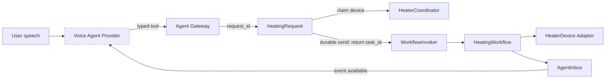

# Voice Heating Lab Agent

An architecture reference implementation for a hands-free laboratory assistant that heats a device to a target temperature, accumulates only valid in-range hold time, closes the device, and exposes the result for in-Agent announcement without blocking the conversation.

The repository deliberately puts the LLM outside the physical safety-control loop. Language understanding is replaceable; heating, timing, locking, recovery, and shutdown are deterministic.

## What this demonstrates

- **A non-blocking Agent Tool:** `start-heating` returns a task ID after durable acceptance. The agent can immediately continue other work.
- **A durable physical workflow:** Restate records task state, timers, device ownership, cancellation, and completion across process restarts.
- **Explicit safety semantics:** success is impossible until `close()` reports that the heater is closed.
- **A real timing policy:** only intervals bounded by two readings within ±0.5°C count toward the hold.
- **Agent-scoped delivery:** completion is stored in the originating Agent session inbox; external push is out of scope.
- **Deterministic verification:** the domain state machine and simulated heater require neither real hardware nor an LLM API key.

## Architecture in one minute



The `Voice Agent Provider` is a deliberate plug-in boundary, not part of this keyless reference runtime. OpenAI Realtime, LiveKit, or a DeepSeek-based STT/LLM/TTS pipeline can all call the same task-level HTTP API. No model receives heater credentials or raw device endpoints.

See [System design](docs/system-design.md) for the complete flow and ownership model.
For a Chinese architecture overview, see [系统设计（中文版）](docs/system-design.zh-CN.md).

## Why the agent is not blocked

`POST /v1/agent/tools/start-heating` does only the synchronous work required for safe acceptance:

1. validate the typed command and confirmation receipt;
2. deduplicate by `requestId`;
3. atomically claim the physical device;
4. durably send a background workflow invocation;
5. return HTTP `202` with `taskId`.

It does **not** wait for heat-up or hold completion. A single agent can therefore answer questions and use unrelated tools while the workflow runs. Multi-agent orchestration is not required for this concurrency property.

## Repository map

```text
src/domain/                 Pure heating state machine and timing policy
src/contracts/              Model-facing and HTTP-facing typed contracts
src/gateway/                Stable Agent Tool HTTP API
src/runtime/                Restate workflows, device lock, inbox, simulator
test/domain/                Fake-time state-machine verification
scripts/e2e.mjs             Docker orchestration and runtime acceptance test
docs/system-design.md       Components, sequence, state and trust boundaries
docs/failure-semantics.md   Failure classification and safe response matrix
docs/production-readiness.md Explicit gaps between this reference and production
docs/adr/                   Technology and Agent-runtime decisions
```

## Run without an API key

Prerequisites: Docker with Compose.

```bash
docker compose up --build -d
```

The stack starts:

- Agent Gateway: <http://localhost:3000>
- Restate ingress: <http://localhost:8080>
- Restate UI and admin API: <http://localhost:9070>
- deterministic simulated heater behind the `HeaterDevice` contract

Start a confirmed task:

```bash
curl -X POST http://localhost:3000/v1/agent/tools/start-heating \
  -H 'content-type: application/json' \
  -d '{
    "requestId": "demo-request-001",
    "agentSessionId": "demo-session",
    "deviceId": "heater-1",
    "targetTemperatureC": 30,
    "holdDurationS": 3,
    "confirmation": {
      "confirmedByUser": true,
      "conversationTurnId": "turn-001",
      "confirmedAt": "2026-08-21T00:00:00Z"
    }
  }'
```

The response arrives before heating completes:

```json
{
  "accepted": true,
  "taskId": "<task-id>",
  "requestId": "demo-request-001"
}
```

Query status and session events:

```bash
curl http://localhost:3000/v1/agent/tools/heating-status/<task-id>
curl http://localhost:3000/v1/agent/sessions/demo-session/events
```

After the Agent has spoken the completion message, it acknowledges the event:

```bash
curl -X POST \
  http://localhost:3000/v1/agent/sessions/demo-session/events/<event-id>/acknowledge
```

That acknowledgement moves a normally completed task from `COMPLETED` to `NOTIFIED`.

## Verify

Node.js 22 is required for the pinned Restate TypeScript SDK.

```bash
corepack enable
pnpm install
pnpm check
pnpm test
pnpm build
docker compose config
pnpm test:e2e
```

The unit tests use explicit observation timestamps and do not sleep. `test:e2e` starts an isolated Compose project and verifies asynchronous acceptance, immediate query/cancel, idempotency, per-device locking, parallel devices, close-failure isolation, runtime restart recovery, and single event delivery.

## Implemented versus intentionally deferred

| Concern | In this repository | Production integration |
| --- | --- | --- |
| Language/voice | Stable typed boundary and confirmation receipt | Realtime Agent provider, VAD, STT/TTS, interruption handling |
| Heater | Deterministic Restate-backed simulator | Authenticated HTTP/vendor adapter with read-back verification |
| Workflow | Restate durable workflow and persistent volume | HA deployment, backups, SLOs, workflow versioning |
| Identity | Agent session and request identifiers | Authentication, authorization, tenant and device registry |
| Notification | Agent session inbox and acknowledgement | Reconnect policy and retained conversation lifecycle |
| Safety | Deterministic rules and fail-closed states | Device-specific limits, emergency procedures, formal risk review |

This is not represented as a certified laboratory control system. The [production-readiness document](docs/production-readiness.md) names the work still required before controlling real equipment.

## Design documents

- [Product contract](docs/product-contract.md)
- [System design](docs/system-design.md)
- [Architecture decisions](docs/architecture-decisions.md)
- [Failure semantics](docs/failure-semantics.md)
- [Production readiness](docs/production-readiness.md)
- [Prior art and reuse assessment](docs/prior-art.md)
- [ADR 0001: Thin Agent and deterministic workflow](docs/adr/0001-thin-agent-durable-workflow.md)
- [ADR 0002: Restate for the reference implementation](docs/adr/0002-restate-runtime.md)

## Repository policy

- Never commit credentials, real device addresses, private datasets, or personal information.
- Use the simulator until a real device contract and safety review are approved.
- No open-source license has been selected; this repository is currently provided for evaluation only.
