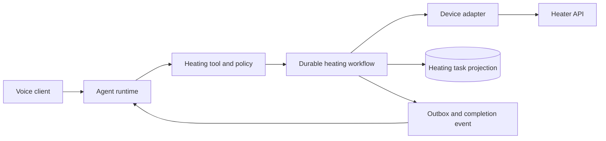

# Architecture Decisions

## Decision 1: Heating is an asynchronous task-level tool

Physical heating lasts much longer than a conversational tool-call round trip. `start_heating` therefore returns a task ID after durable acceptance instead of holding the agent turn open until completion.

The agent remains free to invoke other tools while the heater workflow continues.

## Decision 2: The LLM stays outside the safety-control loop

The LLM is used for language understanding, clarification, confirmation, status explanation, and announcement. Deterministic code owns:

- parameter validation;
- authorization and device selection;
- idempotency;
- one-task-per-device locking;
- tolerance checks;
- accumulated in-range timing;
- retry and timeout policy;
- cancellation and close;
- terminal-state classification.

## Decision 3: A durable workflow owns the lifecycle

The conceptual service path is:

The workflow must make time and recovery testable. Whether an implementation uses a workflow engine or an application-owned persisted state machine is a stack decision, not a product requirement.

## Decision 4: Device integration is behind an adapter

The workflow depends on a narrow domain interface rather than vendor-specific HTTP details. The adapter maps timeouts, retryable errors, response semantics, metrics, and authentication.

A deterministic simulator implements the same interface for local development and tests.

## Decision 5: Sources of truth are explicit

| Concern | Source of truth |
| --- | --- |
| Current temperature | The latest `getTemperature()` response and its observation time |
| Workflow history and timers | Durable workflow history or persisted state-machine record |
| Queryable task status | `HeatingTask` projection derived from workflow transitions |
| User authorization and confirmation | Agent/tool audit record |
| Completion | Successful close plus committed terminal transition |

## Decision 6: Delivery stays inside the agent boundary

The workflow emits a stable completion event. The agent consumes it and creates the user-facing announcement. No separate push, email, or SMS infrastructure is required for the MVP.

## Technical-stack evaluation criteria

Candidate stacks should be compared using:

1. clarity for an external reviewer;
2. durable timers and restart recovery;
3. deterministic fake-time testing;
4. support for agent concurrency and task callbacks;
5. minimal infrastructure and setup time;
6. typed tool contracts and validation;
7. easy simulated-device integration;
8. a credible path from take-home MVP to production without pretending the MVP is production-ready.
