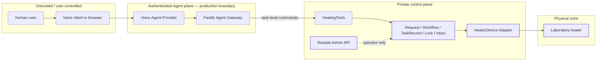

# Security and Trust Boundaries

## Objective

The model-facing surface must expose business tasks, never raw device control. Physical safety also requires distinguishing network isolation, application authorization, and confirmed device state; none is a substitute for the others.

## Trust zones

## Enforced in this repository

- The Fastify Gateway exposes only task-level start, status, cancellation, session-event, and acknowledgement routes.
- `HeatingRequest`, `HeatingWorkflow`, `HeatingTaskRecord`, `HeaterCoordinator`, `HeaterDevice`, and `AgentInbox` are `ingressPrivate` Restate services.
- Docker Compose binds Gateway, Restate ingress, and Restate admin ports to `127.0.0.1`.
- The E2E suite attempts a raw `HeaterDevice` ingress call and requires rejection.
- Raw device credentials and endpoints are not present in model-facing schemas.
- An unconfirmed close never produces `COMPLETED`, and the device reservation remains held.

## Development-only exception

`SimulatorAdmin` is public through local Restate ingress so the E2E suite can inject a close failure. It controls only the deterministic simulator and is explicitly not part of the Agent Tool contract.

A real-hardware deployment must not register `SimulatorAdmin`. Prefer a separate test-only endpoint package or deployment manifest so production omission is mechanically enforced.

## Not yet enforced

| Boundary | Current state | Production control |
| --- | --- | --- |
| Human identity | opaque IDs only | user authentication and subject claims |
| Tenant isolation | not implemented | tenant-scoped task and device authorization |
| Confirmation | client submits a visible receipt | server-issued, proposal-bound, expiring, single-use confirmation ID |
| Gateway to Restate | private Compose network | workload identity and Restate request identity |
| Runtime to device | simulator only | mTLS/API credentials in a secrets manager and device allowlist |
| Restate admin | localhost in Compose | isolated operator network, authentication and audit |
| Rate limits | not implemented | per subject, tenant and device-class limits |
| Audit retention | workflow/object state only | append-only audit sink and privacy policy |

`127.0.0.1` binding protects only the local review setup. It is not authentication and must not be described as a production security control.

## Main abuse paths

### Forged confirmation

`confirmedByUser: true` can be constructed by an untrusted caller. The production flow should first store a server-observed proposal with a hash of device, target and duration, then consume a single-use `confirmationId` only after an authenticated approval event.

### Direct device bypass

Without `ingressPrivate`, a caller with Restate ingress access could call `setTemperature`, `close`, release a reservation, or publish a false event. Internal service privacy blocks that route; network identity must provide the second layer in production.

### Cross-tenant task probing

Task IDs are not authorization. Status, cancel, event listing, and acknowledgement must verify the authenticated tenant and subject against a task/device registry.

### Ambiguous physical side effect

A network timeout can occur after hardware applies a command. Durable workflow execution does not prove exactly-once physical behavior. The adapter must use idempotency keys or read back target/mode/closed state. Unknown close state maps to `NEEDS_ATTENTION`.

### False playback acknowledgement

Only the trusted Provider Adapter may acknowledge an event, and only after actual audio playout. The server should not treat model text generation or transport completion as audible delivery.

## Production gate

Do not connect real hardware until all of the following are demonstrated:

1. authenticated identities and tenant/device authorization;
2. server-issued, single-use confirmation bound to the exact proposal;
3. internal Restate services and admin API unreachable from untrusted networks;
4. device credentials isolated from Agent and browser processes;
5. read-back behavior for ambiguous set/close outcomes;
6. protected operator recovery with audit trail;
7. physical limits, emergency stop, hazard review and approved runbook.
