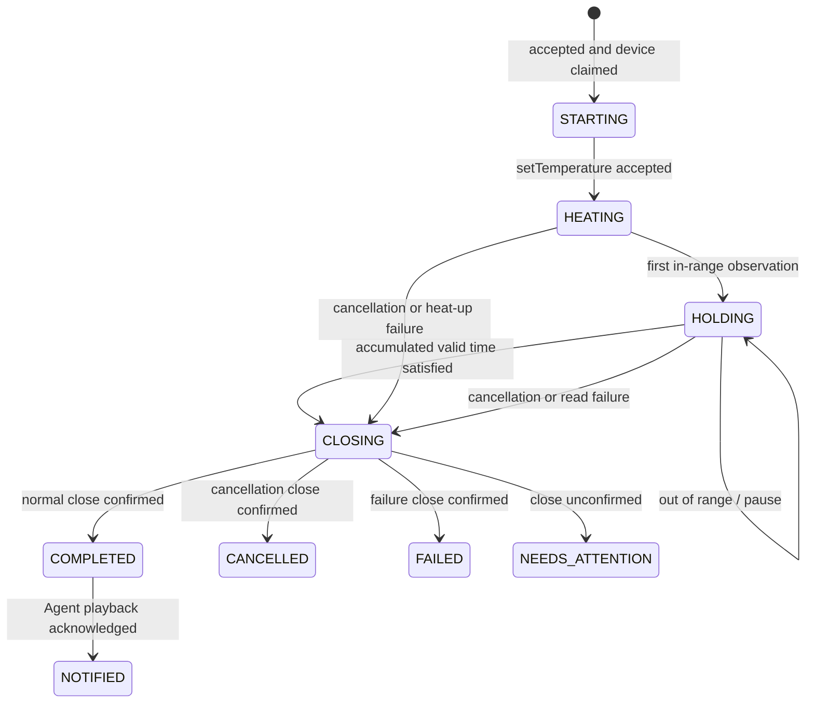

# System Design

## 1. Design objective

The user-visible command is simple—“heat to 80°C and hold for 20 minutes”—but the business operation is long-running, stateful, and safety-relevant. The design separates probabilistic language handling from deterministic physical control.

The central invariant is:

> The Agent may propose and delegate a heating task, but only deterministic workflow code may decide when valid hold time has elapsed and whether the task completed safely.

## 2. Scope

### In scope

- typed task-level commands for start, status, cancellation, and completion acknowledgement;
- explicit user-confirmation evidence before starting a side effect;
- one active task per physical heater;
- durable heat-up, polling, accumulated hold time, cancellation, close, and recovery;
- completion delivery within the originating Agent session;
- deterministic simulator and fake-time domain tests.

### Out of scope for the reference implementation

- a vendor-specific HTTP protocol or real device credentials;
- production authentication, tenant isolation, and device authorization;
- a particular speech/LLM provider;
- external push, SMS, or email;
- certification as a laboratory safety system.

These are explicit integration boundaries rather than hidden assumptions. See [Production readiness](production-readiness.md).

## 3. Components and ownership

| Component | Owns | Must not own |
| --- | --- | --- |
| Voice Agent Provider | speech, clarification, human confirmation UX, spoken output | heater credentials, hold timer, device state |
| Agent Gateway | public Tool API, request validation, upstream error mapping | workflow state or device policy |
| `HeatingRequest(requestId)` | idempotent start result and confirmation audit | task lifecycle |
| `HeatingTaskRecord(taskId)` | durable query projection and serialized cancel/complete arbitration | device polling |
| `HeaterCoordinator(deviceId)` | single active task for a physical heater | temperature or hold calculation |
| `HeatingWorkflow(taskId)` | lifecycle, durable timers, polling, timing reducer, close classification | natural-language decisions |
| `HeaterDevice(deviceId)` | raw device contract and simulator state | user conversation or business completion |
| `AgentInbox(agentSessionId)` | durable in-Agent result delivery and acknowledgement | external notification guarantees |

Each durable entity is keyed by the identifier matching its consistency boundary. Restate serializes writes per object key while allowing different devices, requests, and sessions to progress independently.

## 4. End-to-end service path

```mermaid
sequenceDiagram
    autonumber
    actor User
    participant Agent as Voice Agent
    participant Gateway as Agent Gateway
    participant Request as HeatingRequest(requestId)
    participant Lock as HeaterCoordinator(deviceId)
    participant Record as HeatingTaskRecord(taskId)
    participant Workflow as HeatingWorkflow(taskId)
    participant Device as HeaterDevice(deviceId)
    participant Inbox as AgentInbox(sessionId)

    User->>Agent: “Heat to 80°C and hold 20 minutes”
    Agent->>User: Repeat target and duration; ask to confirm
    User->>Agent: Confirm
    Agent->>Gateway: startHeating(command + confirmation receipt)
    Gateway->>Request: start (key = requestId)
    Request->>Lock: claim(taskId)
    alt device busy
        Lock-->>Request: acquired = false
        Request-->>Agent: DEVICE_BUSY
    else device available
        Lock-->>Request: acquired = true
        Request->>Record: initialize STARTING projection
        Request--)Workflow: durable background invocation
        Request-->>Agent: 202 + taskId
        Note over Agent: The same Agent is free for other work now
        Workflow->>Device: setTemperature(target)
        loop durable polling
            Workflow->>Device: getTemperature()
            Device-->>Workflow: temperature + observation time
            Workflow->>Workflow: deterministic timing transition
            Workflow->>Record: update query projection
        end
        Workflow->>Record: seal cancellation decision
        Workflow->>Device: close()
        alt close confirmed
            Workflow->>Lock: release(taskId)
            Workflow->>Inbox: completion/cancellation/failure event
        else close unconfirmed
            Workflow->>Inbox: NEEDS_ATTENTION alert
            Note over Lock: Reservation is intentionally retained
        end
        Agent->>Inbox: list session events
        Agent->>User: Speak the result
        Agent->>Inbox: acknowledge after playback
        Inbox->>Record: acknowledge matching eventId
    end
```

`HeatingRequest` first commits a queryable task record, then durably sends directly to the workflow and returns immediately. `HeatingTaskRecord` remains queryable beyond workflow-completion retention. It also serializes cancellation against the workflow's final close decision: if cancellation is recorded before sealing it overrides normal completion; after sealing the API returns `accepted: false`. A safety failure already classified before sealing remains a failure rather than being masked as cancellation. The workflow signal only wakes execution quickly and is not the source of the decision.

## 5. State machine



`HOLDING` has an explicit `holdCondition`:

- `IN_RANGE`: time may accumulate;
- `PAUSED_OUT_OF_RANGE`: accumulated time is preserved but does not increase;
- `PAUSED_STALE_OBSERVATION`: an unobserved gap is not credited;
- `SATISFIED`: close is required before success.

## 6. Temperature observation semantics

An observation is in range when:

```text
abs(currentTemperatureC - targetTemperatureC) <= 0.5
```

Real hardware only provides discrete samples, so the system cannot know the exact temperature between polls. The reference implementation uses a conservative, auditable rule:

1. the first in-range observation starts a segment but credits no earlier time;
2. an interval counts only when both its start and end observations are in range;
3. the interval that discovers an out-of-range value does not count;
4. the interval that discovers a return to range does not count;
5. timestamps must be strictly increasing;
6. timestamps cannot predate task acceptance;
7. an interval longer than the configured maximum observation gap is not credited;
8. accumulated time is clamped to the requested hold duration.

If the first accepted in-range observation is timestamped at or after the configured heat-up deadline, the task fails closed. The workflow does not retroactively assume that the device entered range before the sample.

This undercounts rather than knowingly crediting an uncertain interval. The maximum ordinary undercount per transition is approximately one polling period. Poll cadence and device timestamp quality therefore belong in the device policy and audit record.

The pure reducer is implemented in `src/domain/heating-task.ts` and tested with explicit timestamps in `test/domain/heating-task.test.ts`.

## 7. Source of truth

| Concern | Source of truth |
| --- | --- |
| Current physical temperature | Latest successful `HeaterDevice.getTemperature` result and observation time |
| Workflow execution and accumulated-time decisions | `HeatingWorkflow(taskId)` journal |
| Long-lived query status and cancellation arbitration | `HeatingTaskRecord(taskId)` projection |
| Request deduplication | `HeatingRequest(requestId)` result |
| Physical-device ownership | `HeaterCoordinator(deviceId).activeTaskId` |
| User confirmation evidence | `HeatingRequest(requestId).input.confirmation` |
| Agent-scoped delivery | `AgentInbox(agentSessionId)` |
| Normal physical completion | Successful close plus committed `COMPLETED` transition |
| User-visible completion | Agent acknowledgement plus committed `NOTIFIED` transition |

The LLM transcript is never the source of truth for physical state.

## 8. Idempotency and concurrency

### Retrying the same request

The Agent generates a stable `requestId` before the start call. `HeatingRequest` is a keyed durable object, so an exact retry returns the previously stored result and does not generate another task or repeat device ownership side effects. Reusing that ID with a different session, device, target, duration, or confirmation receipt returns `IDEMPOTENCY_CONFLICT` rather than silently attaching the new proposal to the old task.

### Competing requests for one heater

`HeaterCoordinator` serializes `claim` operations by `deviceId`. Exactly one task receives the reservation; later requests return `DEVICE_BUSY`. Different heaters can execute concurrently.

### Agent concurrency

Agent concurrency is obtained by decoupling the conversational request from the physical task, not by adding more agents. Once the durable background invocation is accepted, the conversation turn is complete.

Multi-agent orchestration becomes useful only if the product later adds separately authorized roles—for example a pipetting specialist, experiment planner, and instrument diagnostic agent—with independent context and tools. It is unnecessary for one three-parameter heating command and would add routing and safety ambiguity.

## 9. Confirmation trust boundary

The public start schema requires a confirmation receipt:

```text
confirmedByUser = true
conversationTurnId
confirmedAt
```

This makes the audit dependency visible, but a JSON field alone is not strong proof. In production the Voice Agent Provider must create the receipt from a server-observed conversation event or an SDK approval callback; an untrusted browser or model must not mint arbitrary confirmation receipts. The gateway must authenticate the Agent runtime and bind the receipt to the user, tenant, proposal, device, target, and duration.

The reference runtime intentionally stops at this boundary because no Agent provider or identity system was supplied.

## 10. Completion and Agent reconnection

The workflow publishes a stable event to `AgentInbox(agentSessionId)` and then completes; the physical workflow is not pinned while waiting for a voice connection. When the same application session is available, it lists pending events, speaks the message, and acknowledges the exact `eventId`. The inbox updates the durable task projection to `NOTIFIED`.

For normal completion:

- `COMPLETED` means valid hold time accumulated and physical close was confirmed;
- `NOTIFIED` means the Agent provider subsequently acknowledged delivery after playback.

An acknowledgement proves only what the provider contract defines. A production voice adapter should send it after audio playback succeeds, not when text generation starts.

## 11. Technology mapping

- TypeScript keeps contracts consistent across a browser/voice adapter, gateway, and workflow service.
- Fastify provides a stable product API and prevents Restate ingress URLs from becoming the Agent contract.
- Zod validates untrusted tool inputs at runtime.
- Restate provides keyed single-writer state, durable calls, timers, signals, and restart recovery.
- Docker Compose makes the runtime and embedded durable store reviewable without a cloud account.

All raw device, workflow, lock, request, inbox, and task-record handlers are `ingressPrivate`. Only task-level `HeatingTools` and the explicitly evaluation-only `SimulatorAdmin` are reachable through public Restate ingress. Production must omit `SimulatorAdmin`, avoid publishing Restate admin ports, and configure workload identity.

The rationale and alternatives are recorded in [ADR 0001](adr/0001-thin-agent-durable-workflow.md) and [ADR 0002](adr/0002-restate-runtime.md).
