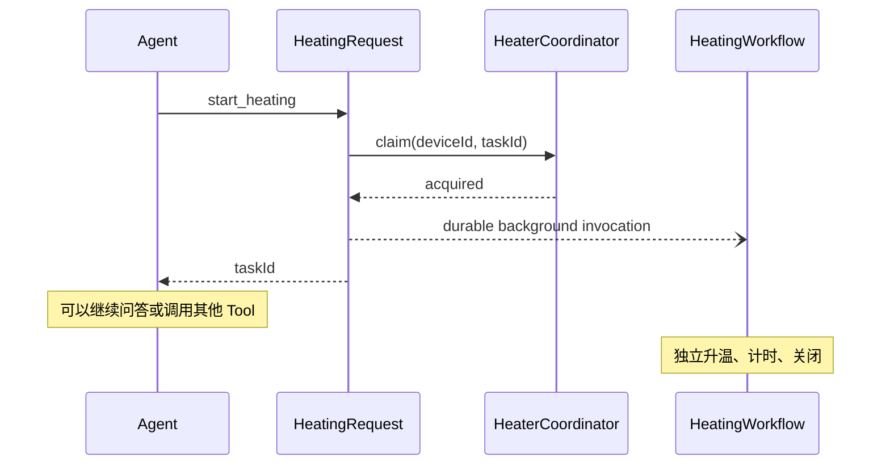

# 系统设计（中文版）

## 1. 核心判断

“加热到 80°C 并保持 20 分钟”表面上只是一次 Tool Call，实际上包含两个生命周期完全不同的系统：

- 对话生命周期：识别意图、澄清参数、复述确认、继续处理其他对话；
- 物理任务生命周期：设备占用、升温、测温、累计有效保温、取消、关闭、恢复和结果交付。

因此核心架构原则是：

> Agent 负责理解、确认、委派和播报；确定性的后台工作流负责所有物理控制和时间判断。

LLM 不持有计时器，不轮询温度，不保存设备凭据，也不决定设备是否已经安全关闭。

## 2. 服务职责

| 服务 | 业务含义 | Source of truth |
| --- | --- | --- |
| Voice Agent Provider | 语音、澄清、确认和播报 | 对话上下文，不是设备状态 |
| Agent Gateway | 稳定的任务级 Tool API | 无持久业务状态 |
| `HeatingRequest(requestId)` | 同一次用户请求只接受一次 | 幂等结果和确认审计 |
| `HeatingTaskAcceptance(taskId)` | workflow 初始化前提供不可变的已接受任务快照 | 只负责接受存根，不拥有运行状态 |
| `HeaterCoordinator(deviceId)` | 一台物理设备最多一个活动任务 | 当前 `activeTaskId` |
| `HeatingWorkflow(taskId)` | 加热任务的完整生命周期 | 状态、计时和终态 |
| `HeaterDevice(deviceId)` | 厂商 API 适配边界 | 最新设备响应；当前实现为模拟器 |
| `AgentInbox(agentSessionId)` | Agent 范围内的完成事件 | 待播报及已确认事件 |

这些服务分别按 `requestId`、`deviceId`、`taskId` 和 `agentSessionId` 分区，是为了让一致性边界与业务实体完全对应。不同设备可以并行，同一设备的写操作仍然串行。接受成功前会先写入 `HeatingTaskAcceptance`，因此拿到 `taskId` 后立即查询不会得到不存在；初始化前到达的取消信号也会由 workflow 启动后消费。

## 3. Agent 为什么不会被加热任务阻塞

`start-heating` 只同步执行安全接受所需要的步骤：

1. 校验温度、时长、设备、会话和确认凭据；
2. 使用 `requestId` 去重；
3. 原子占用 `deviceId`；
4. 可靠地派发后台 `HeatingWorkflow`；
5. 立即返回 `taskId`。



这里需要的是“异步任务”，不是“多个 Agent”。增加第二个 Agent 并不能让物理任务更可靠，反而会增加路由、权限和责任归属的不确定性。

只有未来出现真正独立的角色，例如移液 Agent、实验规划 Agent、仪器诊断 Agent，并且它们拥有不同权限和工具时，才值得增加 multi-agent orchestration。

## 4. 温度与计时

温度在以下条件内有效：

```text
abs(current - target) <= 0.5°C
```

由于设备只能离散采样，两个采样点之间的真实温度无法直接得知。当前选择保守规则：只有区间两端的读数都在范围内，整个区间才计入保温时间。

- 第一次进入范围只开启计时段，不补算之前时间；
- 发现超差的那个采样区间不计时；
- 发现重新回到范围的那个采样区间也不计时；
- 之前累计的有效时间不会清零；
- 时间戳必须严格递增；
- 累计值最多等于用户要求的时长。

如果第一个可接受的范围内读数时间戳已经等于或超过升温截止时间，任务按超时失败并进入关闭流程；系统不会反推设备可能更早已经到温。

这种方案可能少算最多约一个轮询周期，但不会明知采样结果超差仍把该区间计入。轮询频率因此属于设备策略和审计字段，而不是 LLM Prompt。

## 5. 完成、关闭和播报

状态含义被刻意拆开：

- `COMPLETED`：有效保温时间已满足，并且 `close()` 已确认设备关闭；
- `NOTIFIED`：Agent Provider 在完成播报后确认了对应事件；
- `NEEDS_ATTENTION`：无法确认设备关闭，禁止报告正常完成。

如果 Agent 语音连接暂时不在线，完成事件会保存在 `AgentInbox`。任务可以处于 `COMPLETED`，等原 Agent 会话恢复后播报并转为 `NOTIFIED`。这不是短信或外部推送。

## 6. 幂等与设备锁

- Agent 在第一次调用前生成稳定 `requestId`；网络重试继续使用同一个 ID。
- `HeatingRequest(requestId)` 只会在温度、时长、设备、会话和确认凭据完全相同时返回第一次结果；相同 ID 携带不同参数会返回 `IDEMPOTENCY_CONFLICT`。
- `HeaterCoordinator(deviceId)` 保证一台设备只有一个活动任务。
- 正常完成、取消或安全失败在 `close()` 成功后释放设备。
- `close()` 失败时保留设备锁，必须由受保护的人工恢复流程处理。

人工恢复接口不能直接暴露为普通 LLM Tool，否则模型可能在未确认物理安全的情况下解除设备隔离。

## 7. 确认边界

开始请求必须携带：

- `confirmedByUser = true`；
- 对话 turn ID；
- 确认时间。

这使确认依赖在 Contract 和审计记录中可见，但 JSON 布尔值本身还不是可信证明。生产版本应由服务端 Agent Adapter 根据实际确认回合签发凭据，并绑定用户、租户、设备、温度和时长。浏览器或 LLM 不能自行伪造。

当前仓库没有 API Key 和身份系统，因此明确停在这个适配边界，不假装已经解决认证问题。

## 8. 技术栈理由

- TypeScript：浏览器语音入口、Zod Tool Contract、Gateway 和 Restate Workflow 共用类型；
- Fastify：向 Agent 暴露稳定产品 API，不让 Restate 内部 URL 变成产品 Contract；
- Restate：提供按 key 的单写者、持久状态、可靠调用、timer、signal 和崩溃恢复；
- Docker Compose：不需要云账号即可审查完整编排和 Restate UI；
- Vitest + 显式时间戳：不真实等待就能证明 ±0.5°C、暂停/恢复和关闭语义。

第一版不采用 DeepSeek Harness。它是通用 Agent Harness，不是实时语音或物理设备持久工作流。未来可以使用 DeepSeek 模型的 Tool Calling，但仍然调用相同的任务级 API。

## 9. 生产差距

真实设备接入前仍需补齐：

- 用户认证、租户隔离、设备权限和服务端确认凭据；
- 真实设备协议、温度限制、超时、厂商错误和幂等语义；
- `setTemperature`/`close` 响应丢失后的设备状态回读；
- Restate 高可用、备份、监控、workflow 版本升级；
- `NEEDS_ATTENTION` 告警和人工恢复 Runbook；
- 真实实验风险分析、紧急停止和人工覆盖机制。

详细英文设计见 [System design](system-design.md)，故障分类见 [Failure semantics](failure-semantics.md)，生产边界见 [Production readiness](production-readiness.md)。
