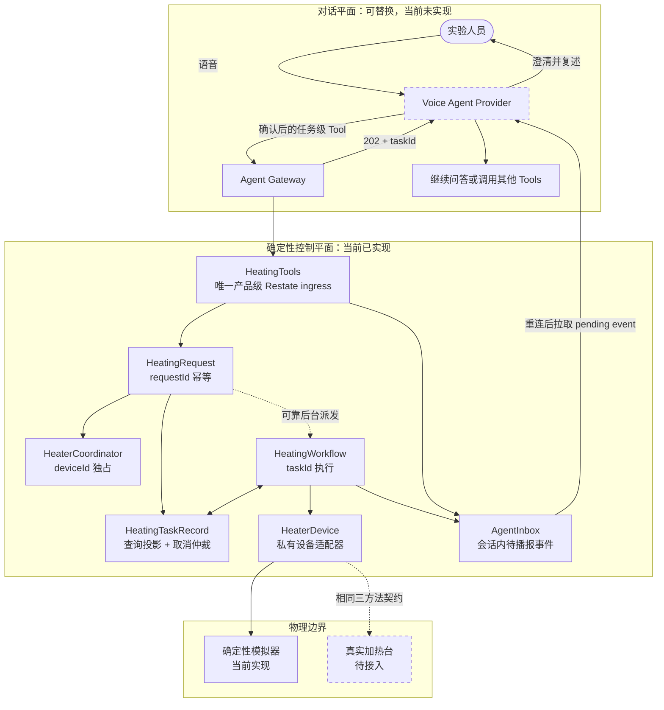
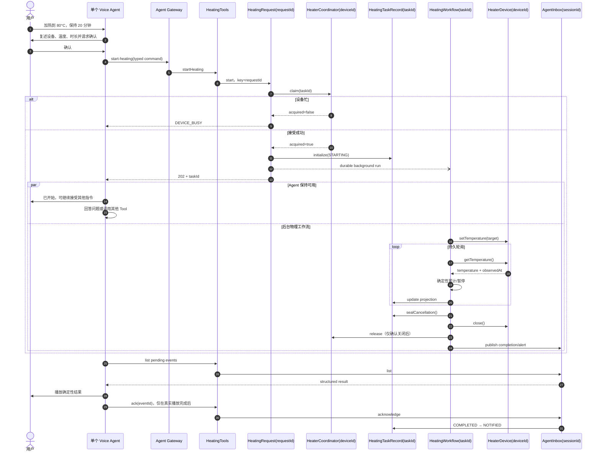
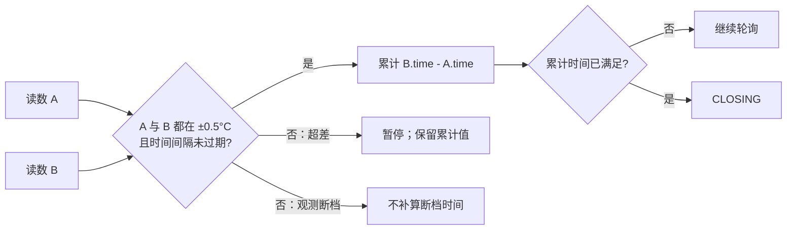
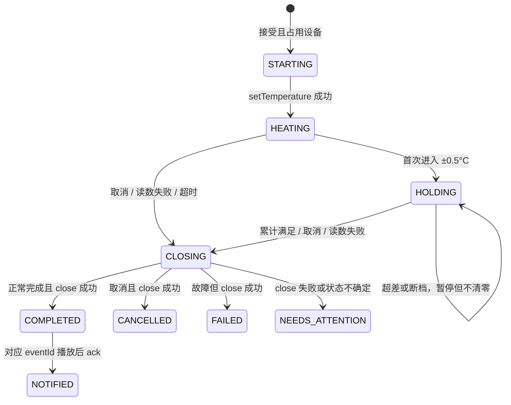
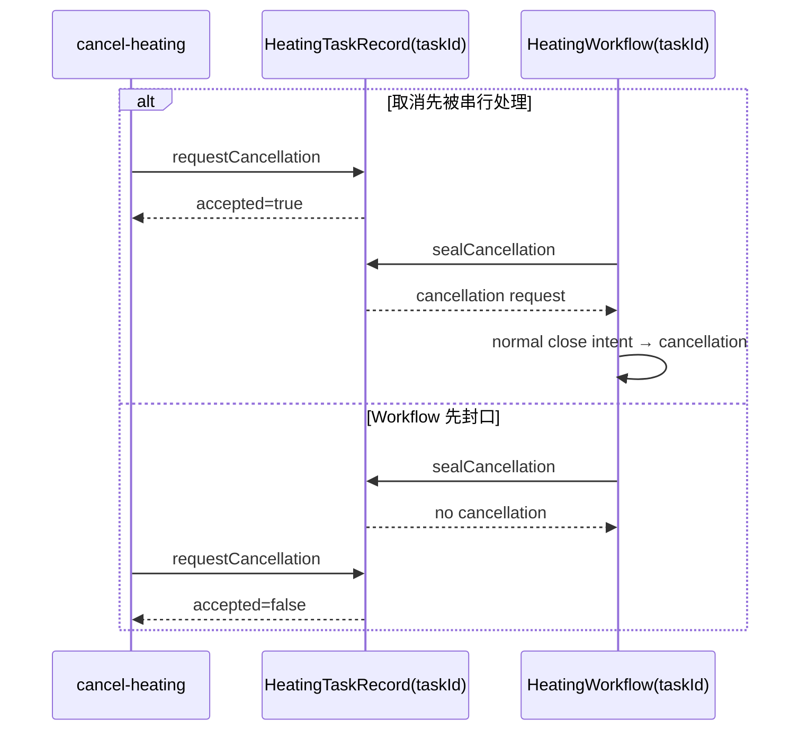

# 系统设计（中文版）

## 1. 一句话架构

> 单个 Voice Agent 负责理解、澄清、确认、委派和播报；按任务持久化的确定性工作流负责加热、测温、累计有效保温时间、取消、关闭和恢复。

“加热到 80°C 并保持 20 分钟”不是一个需要长时间占住对话回合的 Tool Call。`start-heating` 在任务被可靠接受后返回 `taskId`；此后物理过程与 Agent 会话并行。这里需要的是异步工作流，不是第二个 Agent。

## 2. 系统全景与实现边界



图中虚线节点是明确的生产集成边界，不是已经完成的能力。当前仓库可无 API Key 运行控制平面、模拟器和完整 E2E，但不能直接进行真实语音对话或控制真实硬件。

## 3. 服务职责与一致性键

| 服务 | Key | 唯一职责 / Source of truth | 不负责 |
| --- | --- | --- | --- |
| Voice Agent Provider | 应用会话 ID | 语音、澄清、确认 UX、播放完成信号 | 设备凭据、计时、温度状态 |
| Agent Gateway | 无 | 稳定任务级 HTTP Tool Contract、输入和错误映射 | 持久业务状态 |
| `HeatingRequest` | `requestId` | 请求幂等结果和原始确认审计 | 运行状态 |
| `HeaterCoordinator` | `deviceId` | 当前 `activeTaskId`，保证一台设备一个任务 | 温度和计时 |
| `HeatingTaskRecord` | `taskId` | 长期可查询投影；串行化“取消还是完成”决策 | 设备轮询 |
| `HeatingWorkflow` | `taskId` | 持久执行、轮询、计时 reducer、关闭和事件发布 | 自然语言判断 |
| `HeaterDevice` | `deviceId` | `setTemperature/getTemperature/close` 设备契约 | 用户会话 |
| `AgentInbox` | `agentSessionId` | 待播报事件、eventId 去重和 ack | 外部推送保证 |

按业务实体选择 Key 是并发模型本身：不同 `deviceId` 可以并行，同一设备的 claim/release 串行；同一 `taskId` 的取消和完成由同一记录对象仲裁；同一会话的播报事件按顺序写入 Inbox。

## 4. 服务编排：接受请求后立即释放 Agent



`HeatingRequest` 使用 Restate 的 workflow send 直接可靠派发，不等待 Workflow 结束，也不需要额外的长期 Invoker invocation。即使语音连接断开，物理任务仍继续；结果留在 `AgentInbox`，原应用会话恢复后再拉取。

## 5. 温度与累计保温算法

范围判定为闭区间：

```text
abs(currentTemperatureC - targetTemperatureC) <= 0.5°C
```

设备只提供离散读数，因此系统不能证明两个采样点之间每一刻都在范围内。当前采用保守、可审计的“两端都有效才计时”规则：



- 第一次进入范围只建立计时段，不补算之前时间；
- 发现超差的区间不计，回到范围的第一个区间也不计；
- 超差后保留累计值，重新进入范围后继续；
- 读数时间戳必须严格递增且不得早于任务接受时间；
- 两次读数间隔超过 `MAXIMUM_OBSERVATION_GAP_MS` 时不补算无人观测的时间；
- 累计值最多等于用户要求时长。

这会保守地少算约一个轮询周期，但不会把已知不可靠的区间算成有效保温。轮询周期、允许观测断档和升温超时都是运行配置，不由 Prompt 决定。

## 6. 状态机与关闭语义



关键语义：

- `COMPLETED` 只表示有效保温已满足并且 `close()` 已明确返回关闭成功；
- `NOTIFIED` 是独立的用户交付状态，不反向控制物理任务生命周期；
- `FAILED` 表示业务失败但物理关闭已确认；
- `NEEDS_ATTENTION` 表示无法确认关闭，设备锁保留，禁止正常完成播报；
- 成功的 `close()` 是当前已知设备 Contract 下的物理关闭事实源。

## 7. 取消与完成竞态

最后一个有效温度读数与用户取消可能同时发生。仅靠 Workflow 内检查一次 signal 会产生“取消返回 accepted=true，但最终仍 COMPLETED”的竞态。



`HeatingTaskRecord(taskId)` 是单写者对象，所以只有一个顺序成立。对外返回的 `accepted` 与正常完成/取消仲裁一致；Workflow signal 只负责快速唤醒，不再负责决定谁赢。若在 seal 前已经分类出读数失败、超时等安全故障，故障终态优先，不会被取消掩盖。

## 8. 为什么不需要 Multi-Agent

当前任务只有一个用户意图、一个确认主体和一个物理副作用所有者。并发需求来自“对话与后台设备任务同时存在”，已由 durable workflow 解决。

首版使用 Multi-Agent 会额外引入：

- 哪个 Agent 有权产生副作用；
- 重复 Tool Call 和 requestId 归属；
- 会话上下文、确认凭据和完成事件路由；
- 调试与评估的不确定性。

只有出现真正独立的角色、上下文、工具和权限，例如实验规划、移液、仪器诊断和合规审查，并且单 Agent eval 已证明不足，才引入 Multi-Agent。届时仍应只有一个受信 Coordinator 能提交 `start-heating`。

## 9. Agent / Provider 边界

第一版生产接入建议使用一个真实的 Voice Agent 作为薄适配器：

1. 语音活动检测、转写和打断；
2. 提取设备、温度和时长，缺失时澄清；
3. 精确复述并获得用户确认；
4. 由服务端签发一次性确认 ID；
5. 调用本仓库任务级 API；
6. 正常对话同时轮询/订阅 pending events；
7. 音频真实播放完成后才 ack。

OpenAI Realtime/Agents SDK 是最短实时语音路径；LiveKit 更适合首版就要求多供应商或 SIP；DeepSeek Harness 是通用 Agent Harness，不提供实时语音，也不能替代 Restate 的持久物理工作流。所谓 provider-neutral 仅表示下层工作流 API 不变，并不表示不同 Provider 无需各自适配器或能力完全等价。

## 10. 信任边界

- 公开产品入口是 Fastify Gateway；LLM 只看任务级 Tool。
- Restate 中的设备、Workflow、锁、Inbox、Request 和 TaskRecord 均为 ingress-private。
- 本地 Compose 的 8080/9070 只绑定 `127.0.0.1`；生产环境不得把 Admin API 暴露给不可信网络。
- `SimulatorAdmin` 仅用于评估环境故障注入，真实硬件部署必须移除。
- 当前 `confirmedByUser: true` 只使确认依赖可见，不是生产授权；生产需服务端签发并绑定用户、租户、会话、设备、温度、时长、过期时间和一次性消费状态。

完整安全说明见 [Security boundaries](security-boundaries.md)。

## 11. 已验证与未实现

已自动验证：

- ±0.5°C 闭区间、暂停/恢复、观测断档、旧时间戳拒绝；
- 非阻塞接受、请求幂等、同设备互斥、不同设备并行；
- 未知任务 404、取消、关闭失败保留锁；
- runtime 重启后不把断档时间补算为有效保温；
- 内部 Restate 服务无法从 public ingress 直接调用；
- 终态保存在独立任务投影；pending event ack 后不重播。

仍属于生产边界：

- 真实 Voice Agent、扬声器 playout 信号和断线双连接策略；
- 可信身份、租户隔离和一次性确认凭据；
- 真实设备 adapter contract tests、含糊副作用回读与安全限值；
- Restate HA、备份恢复、服务身份、监控、告警和人工恢复 Runbook；
- 正式实验风险分析与认证。

验收映射见 [Verification matrix](verification-matrix.md)，取舍和剩余风险见 [技术交付报告](technical-delivery-report.zh-CN.md)。
