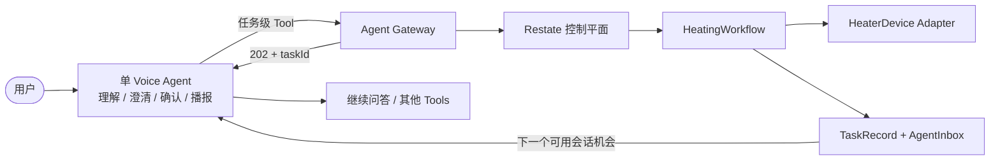

# 技术交付报告（中文版）

## 1. 交付定位

这个仓库交付的是一个可运行、可测试、可恢复的 **Voice Heating Agent 控制平面参考实现**，重点回答以下工程问题：

1. Agent 如何在加热期间继续做其他事情？
2. 为什么 LLM 不能直接拥有计时、温度判断和设备关闭？
3. 进程重启、温度超差、取消竞态和关闭失败如何处理？
4. 哪些能力已经运行验证，哪些是接真实业务前必须补的边界？

它不是完整语音产品，也不是认证过的实验室控制系统。Voice Provider、可信身份/确认和真实设备 Adapter 被明确保留为下一层集成工作。

## 2. 最终架构判断

采用“一个薄 Voice Agent + 一个确定性持久工作流”，而不是让 Agent 回合持续 20 分钟，也不是使用多个 Agent 模拟后台任务。



并发来自两个生命周期解耦：Agent turn 在 durable acceptance 后结束，设备工作流独立运行。增加第二个 Agent 不会增强定时器、设备锁或崩溃恢复。

## 3. 技术栈选择与理由

| 层 | 选择 | 选择理由 | 明确代价 |
| --- | --- | --- | --- |
| 语言 | TypeScript / Node.js 22 | Gateway、Tool Contract、Workflow 共用类型；适合后续 Web Voice Adapter | 真实设备若只有 Python SDK，需独立 Adapter 服务 |
| HTTP | Fastify + Zod | 小、明确、运行时校验；隔离产品 API 与 Restate 内部 URL | 当前未含认证/租户中间件 |
| 持久编排 | Restate 1.7.2 + SDK 1.16.4 | keyed single-writer、durable send、timer、signal、replay 与本地 UI 对本题映射直接 | Reviewer 熟悉度较低；Server BSL；生产需 HA/身份/备份 |
| 本地运行 | Docker Compose | 无云账号、无 API Key，一条命令看到全栈 | 单节点不是生产拓扑 |
| 测试 | Vitest + 显式时间戳 + Compose E2E | reducer 无真实等待；基础设施行为由真实 Restate 容器证明 | 尚无 Voice Provider 和真实硬件 E2E |

### 为什么不是 PostgreSQL + Worker

该方案熟悉且透明，但首版需要自行正确实现 lease、fencing、due-task scan、持久 timer、取消 signal、恢复和 outbox。它可以成为已有 Postgres 平台中的合理选择，但在独立 take-home 中会让基础设施代码淹没产品状态机。

### 为什么不是 Temporal

Temporal 是成熟生产候选，durable timer、workflow versioning 和测试生态更强。但本题还需另建按 `deviceId` 的互斥模型，部署和概念面更大。若目标公司已有 Temporal 平台，应优先复用，不必坚持 Restate。

### 为什么不用 DeepSeek Harness 作为核心

DeepSeek Harness 是 developer-preview 的通用 Agent Harness，提供 typed tools、session、approval 和 background jobs，但不提供实时语音；默认本地 jobs 是进程内状态，也不能替代持久物理工作流。它未来可以作为文本 Agent 或工具编排层，但本题核心仍需要 Restate/Temporal/持久状态机。

### 第一版是否应该有 Agent

产品最终必须有一个真实 Voice Agent，因为澄清、精确复述、确认、打断、断线恢复和播报属于用户验收路径。但实现顺序先证明无 LLM 的确定性控制核心，再接一个薄 Provider Adapter。当前仓库完成前一部分并清楚定义后一部分的 Contract。

推荐下一纵向切片是 OpenAI Realtime/Agents SDK 的单 Agent；若首版就必须多 Provider/SIP，再选 LiveKit。不同 Provider 需要专用适配器，只有下层任务 API 保持不变。

## 4. 代码与业务模型对应

| 业务概念 | 实现位置 |
| --- | --- |
| ±0.5°C、累计有效时长、关闭终态 | `src/domain/heating-task.ts` |
| Tool 输入、确认回执、事件 Contract | `src/contracts/heating-tools.ts` |
| Agent 产品 API | `src/gateway/server.ts` |
| requestId 幂等接受 | `src/runtime/heating-tools.ts` / `HeatingRequest` |
| deviceId 独占 | `src/runtime/heater-coordinator.ts` |
| taskId 持久执行 | `src/runtime/heating-workflow.ts` |
| taskId 长期投影和取消仲裁 | `src/runtime/heating-task-record.ts` |
| agentSessionId 内播报 | `src/runtime/agent-inbox.ts` |
| 三方法设备契约和模拟器 | `src/runtime/simulated-heater.ts` |

## 5. 本轮技术审计发现与修复

| 问题 | 失败表现 | 修复 | 验证 |
| --- | --- | --- | --- |
| 取消 / 完成竞态 | cancel 可能返回 `accepted=true`，任务仍正常完成 | `HeatingTaskRecord` 用单写者顺序仲裁；Workflow close 前 seal；安全故障不被取消掩盖 | reducer 测试 + Docker cancel path |
| Workflow retention 后状态丢失 | 终态过期后只能得到旧 `STARTING` 或失败 | 每次 transition 更新独立持久投影；状态查询只读投影 | 立即查询、终态和 ack 状态 E2E |
| runtime 停机期间补算保温 | 两个范围内读数间隔很大时错误累计整个断档 | `MAXIMUM_OBSERVATION_GAP_MS`，断档后从新 segment 继续 | stale-gap 单元测试 + runtime restart E2E |
| 历史样本提前计时 | 任务开始前的读数可完成保温 | 拒绝 `observedAtMs < startedAtMs` | 单元测试 |
| 未知 task 产生幽灵取消 | 查询/取消不存在任务可能创建 workflow 状态 | 先查询 `HeatingTaskRecord`，Gateway 返回 404 | E2E |
| acknowledged event 重放 | 已播报事件仍出现在 pending 列表 | Inbox 只列未 ack 事件 | E2E |
| 物理 Workflow 等待语音 ack | 离线会话无限 pin workflow revision | Workflow 发布事件后结束；Inbox ack 更新 TaskRecord | COMPLETED → NOTIFIED E2E |
| Restate 内部服务可绕过 Gateway | 调用者可直接 set/close/release/configure | 内部服务全部 `ingressPrivate`；模拟器控制面明确隔离 | public ingress bypass E2E |
| Compose 端口暴露面过宽 | 8080/9070 绑定所有宿主接口 | 本地仅绑定 `127.0.0.1` | Compose config + E2E |

## 6. 正确性边界

### 时间

- 进入范围：`abs(current - target) <= 0.5`，边界值包含；
- 第一个范围内读数只建立 segment；
- 只有相邻两端读数都在范围内且 gap 未过期才计时；
- 超差暂停但不清零；恢复后继续；
- 观测断档不补算；旧时间戳、重复时间戳和非有限数失败关闭；
- 满足累计时长后必须先 close，不能直接成功。

### 副作用

Restate 能持久记录调用结果，但不能把物理 HTTP 命令神奇变成 exactly-once。真实 Adapter 必须为 set/close 定义：幂等 key、响应丢失后的读回、可重试错误和状态不确定分支。无法确认关闭时进入 `NEEDS_ATTENTION` 并保留设备锁。

### 交付

`COMPLETED` 表示物理任务完成且关闭确认；`NOTIFIED` 表示 Provider 对对应 `eventId` 报告播放完成。文本生成完成或服务端 `response.done` 不等于扬声器已播放完；真实 Adapter 必须等待 playout/drain 信号。

## 7. 安全与信任

当前只暴露任务级操作：start、status、cancel、session events 和 ack。LLM 不获得 Restate 内部路径、设备凭据或 raw heater 方法。

这仍不是生产安全边界：localhost bind 和 ingress-private 不是完整认证。生产必须补 workload identity、Gateway 用户认证、租户/设备授权、一次性确认 ID、网络策略、审计和 Restate request identity。评估专用 `SimulatorAdmin` 必须从真实设备部署中删除。

## 8. 验证证据

本轮本地新鲜结果：

```text
pnpm check                 PASS
pnpm test                  PASS — 20/20
pnpm build                 PASS
docker compose config      PASS
pnpm test:e2e              PASS
```

E2E 使用真实 Restate Server 1.7.2 和隔离 Compose project，验证 private ingress、非阻塞接受、404、幂等、设备锁、并行设备、取消、关闭失败、runtime restart、断档计时、持久投影和 pending delivery。详细映射见 [Verification matrix](verification-matrix.md)。

## 9. 下一阶段优先级

### P0：接真实 Voice Agent 之前

1. 服务端 `PendingHeatingProposal(confirmationId)`：绑定 subject/tenant/session/device/target/duration/hash/过期/usedAt；start 只消费一次性 ID。
2. `ConversationRuntimePort`：连接、重连、打断、真实播放完成。
3. Provider E2E：缺参澄清、精确复述、运行中继续问答、重连播报、中断不 ack。

### P0：接真实硬件之前

1. 将 production `HeaterDevice` 三方法与 simulator admin 完全分包；
2. 建立 Adapter contract suite 和故障注入；
3. 明确目标温度范围、最大时长、命令超时、read-back 和紧急停止；
4. 完成危害分析、人工覆盖和 `NEEDS_ATTENTION` Runbook。

### P1：生产运行

Restate HA、volume backup/restore、server restart E2E、workflow versioning、结构化审计、指标告警、Inbox retention/lease 与双连接 eventId 去重。

## 10. 面试说明建议

建议演示顺序：

1. 先说明产品 Contract 与三条不可破坏的事实：±0.5°C 累计、close 后才完成、Agent 不被阻塞；
2. 用系统图解释对话平面和控制平面分离；
3. 跑单元测试说明时间算法，再跑 E2E 展示重启和关闭失败；
4. 主动指出 Voice/身份/真实设备未实现，并解释为什么它们是集成边界而不是隐藏缺口；
5. 用取消仲裁和 ingress-private 修复说明审计如何改变架构，而不只是补 happy path。

这比声称“已经是完整 Agent 产品”更能体现工程判断：实现与证据匹配，风险被命名，下一步有清晰纵向切片。
